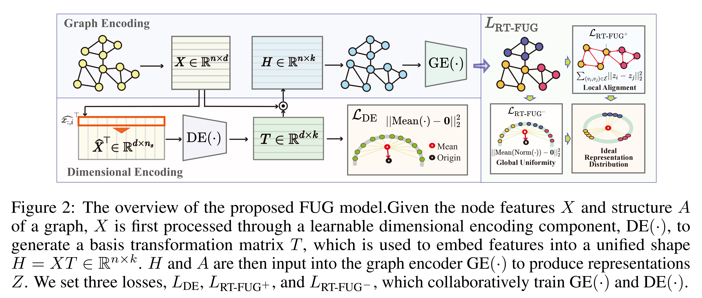
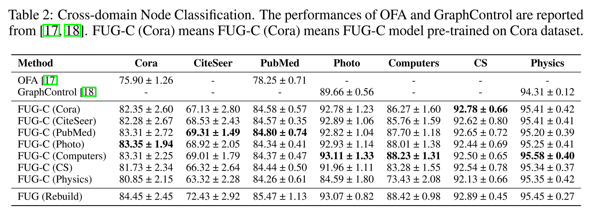

# **FUG: Feature-Universal Graph Contrastive Pre-training for Graphs with Diverse Node Features** 

Hello, this is the official code for **FUG model**.


## 1. What is FUG model

FUG model is a universal graph pretraining model, which can be directly used in verious graph datasets even they have different features shapes, and importantly, without any pre-processing. All components are learnable. 

**We have released a FUG model which pretrained on 7 datasets, which can directly support your work by generating node representation on graph with any features shape.**

**we’re excited to see how FUG might support your work in graph analyzing and beyond.**

An overview of FUG model is given below.




In cross-domain scenarios, FUG shows **strong** transfer capability, achieves comparable or even superior performance compared with the in-domain rebuild model. (As shown in below)




## 2. How to use FUG

### 2.1 Reproduce the results in the paper

**For cross-domain results.**

1. Go to the folder "FUG_CrossDomain".

2. Please check line 3 in the file "run_cross_all", making sure that the value of "datadir" is what you want. (If there is no dataset in this path, it will be downloaded automatically)
3. Run this command: `bash run_cross_all`

**For in-domain results.**

1. Go to the folder "FUG_InDomain"

2. Please check line 3 of all bash files, making sure that the value of "datadir" is what you want. (If there is no dataset in this path, it will be downloaded automatically)
3. Run this command: `bash run_{dataset_name}`

### 2.2 How to use the pretrained FUG model

<font color=red>**We have provided an example in ./Example_for_easily_using_FUG/Example_for_easily_using_FUG.ipynb** </font>

If you have any questions, please feel free to email the first author.

Hope FUG could help your work!!!


## Cite

Please cite our paper if FUG helps your work.

```
@article{zhao2024fug,
  title={FUG: Feature-Universal Graph Contrastive Pre-training for Graphs with Diverse Node Features},
  author={Jitao Zhao, Di Jin, Meng Ge, Lianze Shan, Xin Wang, Dongxiao He, Zhiyong Feng},
  journal={NeurIPS},
  year={2024}
}
```